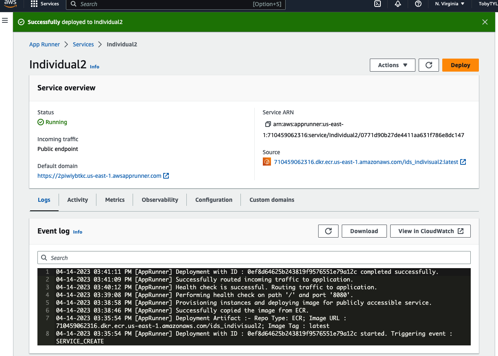

# Topic: Web crawler for NBA live scores

## Introduction
As an NBA fan, the most concerned thing is the progress of each game. Suppose you just want to know the game's score and do not want to be disturbed by the information on the cluttered website. This demo will be perfect for you. All you need to do is open the demo and type in `cargo run`, then the game scores will appear in your console. This demo is still in its early stages. I am still working on it and updating other features.

## Week 1

- [x] Configure GitHub codespace (Copilot, Makefile, ...)
- [x] Develop my first Rust project
- [x] Be familiar with how to programming in Rust
- [x] Creating the Project and Adding Dependencies
- [x] Get the NBA API resources
- [x] Link to http and parse in html
- [x] Check the resource code and Extracting Information from HTML
- [x] Based on the request library in Rust to get the NBA game live score
- [x] Used iterator and closures to simplify code

## Week 2
- [X] Refine the .gitignore file
- [X] Explore more feature on the NBA website
- [X] Finished two recommended Coursera classes this week
- [X] Read five chapter Rust book (The Rust Programming Language)
- [ ] Consider the game hasn't started yet - no score only team names
- [ ] Still debugging with the CSS Selector
- [ ] Connect with cloud service
## Usage
`cd spider`

`cargo run`

